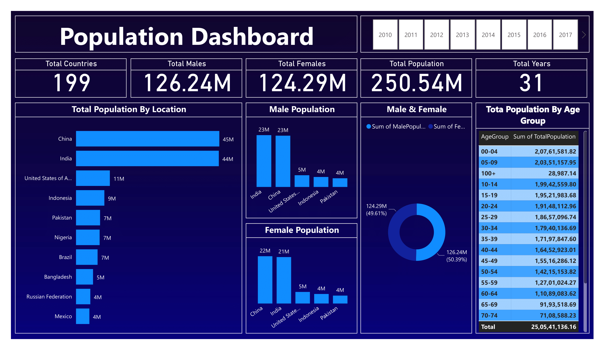

# Population Analysis

This Project created by Nisrag Bsc.Data

## Table of Contents
- [Screenshots](#screenshots)
- [Features](#features)
- [Installation](#installation)

## Screenshots

Include screenshots or images showcasing your project. Use relative paths for images inside your project.




## Features

📊 Excited to share our latest Power BI Dashboard unveiling fascinating insights into population trends! 🌐💡
🔍 Dive deep into the demographics with our user-friendly interface, where every click unveils a new layer of information. From age distribution to regional growth patterns, our dashboard transforms raw data into actionable intelligence.
📈 Witness the power of visual storytelling as we break down complex population data into compelling charts and graphs. Uncover the stories behind the numbers and make informed decisions for your business or community planning.
🌍 Explore global, national, and regional trends effortlessly, thanks to interactive maps and filters that put you in control. Our goal is to empower you with the tools to understand and navigate the ever-changing landscape of population dynamics.
💼 For businesses, this dashboard provides a strategic advantage by identifying potential markets, consumer preferences, and workforce trends. Stay ahead of the curve with data-driven insights that inform your growth strategies.
🏠 Community planners will find value in understanding local population shifts, aiding in resource allocation, infrastructure planning, and community development initiatives.
🚀 Elevate your decision-making process with our Power BI Dashboard! Visit [Your Company Website] to experience the future of data-driven insights. 


## Installation

Provide instructions on how to install your project. You can include code snippets or commands.

```bash
npm install your-package-name
